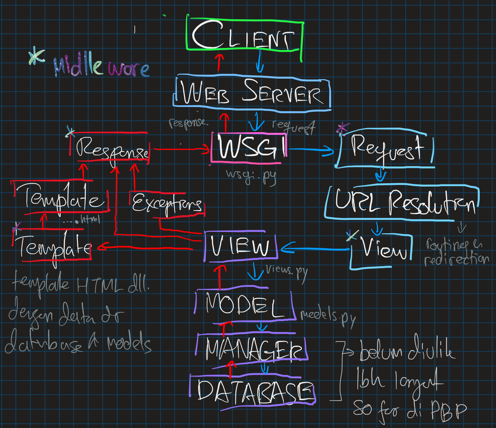
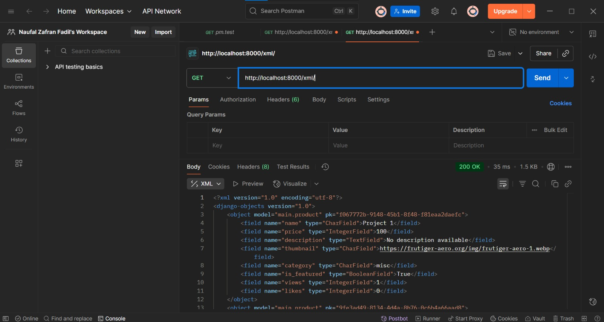
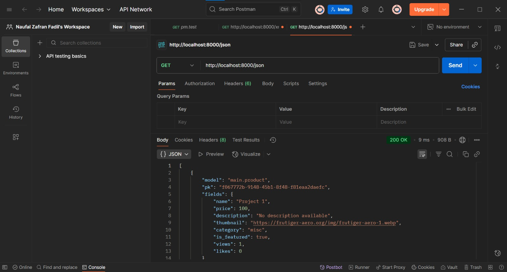
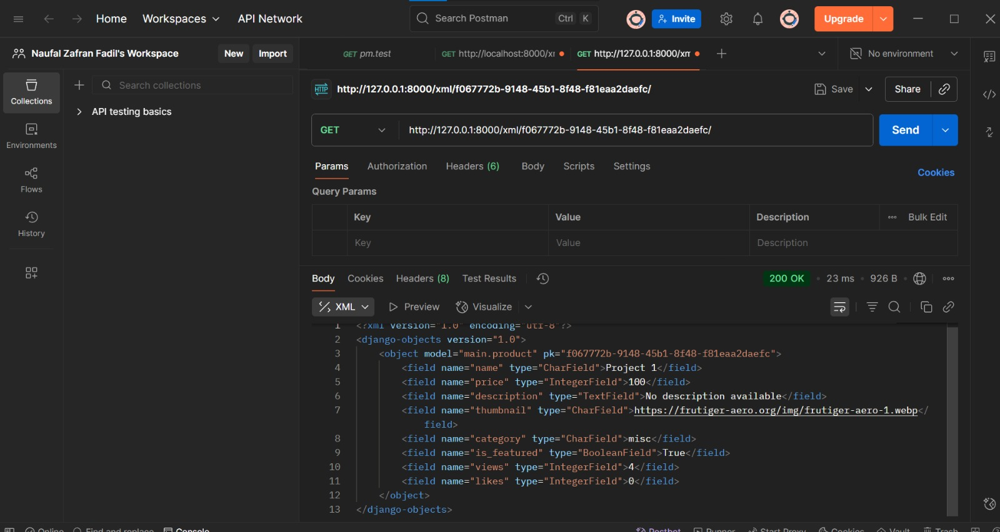
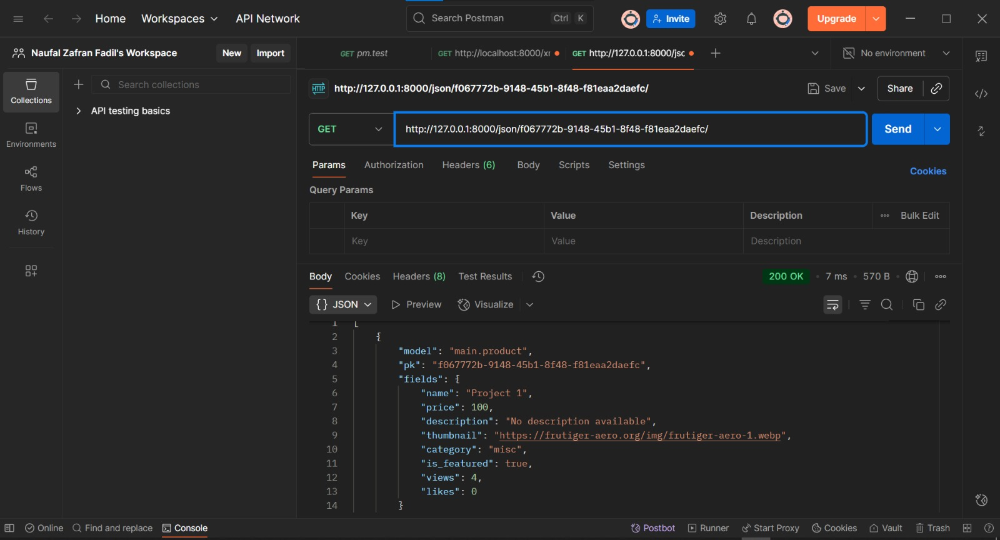

# Tugas 2: Implementasi Model-View-Template (MVT) pada Django

## 🌐 Link Aplikasi  
Aplikasi hasil *deployment* dapat diakses di tautan berikut:  

[⚽💰 Football Bidding ⚽💰](https://naufal-zafran-footballbidding.pbp.cs.ui.ac.id/)  

---
 

## 🛠️ Implementasi Step-by-Step  

### 1. Membuat Proyek Django Baru  
Menjalankan perintah berikut untuk membuat proyek:  
```bash
django-admin startproject football-bidding .
```
_jangan lupa ```.``` di akhir ya_

Langkah ini bertujuan untuk men-setup 'fasilitas' dar django utnuk mempermudah pengembangan web. Sebelumya, kita harus telah mengundur requirement yang terkait

### 2. Membuat Aplikasi `main`

Menjalankan perintah:

```bash
python manage.py startapp main
```

Kemudian menambahkan `main` ke dalam `INSTALLED_APPS` di `settings.py`.

### 3. Routing Aplikasi `main`

* Membuat file `urls.py` di dalam aplikasi `main`.
* Menghubungkan aplikasi `main` dengan `urls.py` pada proyek utama menggunakan `include()` dan ```urlpatterns``` yang berfungsi untuk merujuk ke ```main```.

### 4. Membuat Model `Product`

Pada `models.py` aplikasi `main`:

```python
class Product(models.Model):
    CATEGORY_CHOICES = [
        ('historic', 'Historic'),
        ('exclusive', 'Exclusive'),
        ('fan', 'Fan'),
        ('misc', 'Miscellanous'),
    ]
    
    name = models.CharField()
    price = models.IntegerField()
    description = models.TextField()
    thumbnail = models.URLField()
    category = models.CharField(choices=CATEGORY_CHOICES)
    is_featured = models.BooleanField()
    likes = models.IntegerField()
    
    def __str__(self):
        return self.name
    
    @property
    def is_product_trending(self):
        return self.likes > 100
        
    def increment_likes(self):
        self.news_views += 1
        self.save()
```

Saya membuat model seperti demikian untuk mengakomodasi objek yang sering menjadi interaksi user. ```CATEGORY_CHOICES``` adalah kategori barang lelangan. Saya juga menambahkan beberapa _field_ yang relevan dalam fitur terkait wesite lelang ini selain dari yang telah dispesifikasi

Menjalankan migrasi database agar perubahan ini terekam:

```bash
python manage.py makemigrations
python manage.py migrate
```

### 5. Membuat Fungsi pada `views.py`

Membuat fungsi `show_main` untuk menampilkan nama aplikasi, nama, dan kelas melalui template HTML yang tersimpan pada `main.html`.

### 6. Routing `main/urls.py`

Menambahkan kode berikut:

```python
from django.urls import path
from . import views

urlpatterns = [
    path('', views.index, name='index'),
]
```

### 7. Deployment ke PWS

* Membuat project baru di PWS
* Menyalin kredensial dari PWS ke dalam kode saya
* Mengatur konfigurasi web app agar proyek dapat diakses secara publik.
* Menjalankan kode berikut:

```shell
git add .
git commit -m "yapping"
git push origin master
git push pws master
```

---

## ❓ Pertanyaan & Jawaban

### 1. Bagaimana cara kamu mengimplementasikan checklist di atas secara step-by-step?  

Saya memulai dengan membuat proyek Django baru menggunakan `django-admin startproject football-bidding.`, lalu membuat aplikasi `main` dengan `python manage.py startapp` dan menambahkannya ke `INSTALLED_APPS` di `settings.py`. Setelah itu, saya mengatur routing dengan membuat `urls.py` di aplikasi `main` dan menghubungkannya dengan `urls.py` proyek utama agar request yang masuk dapat diarahkan ke aplikasi. Selanjutnya, saya membuat model `Product` di `models.py` dengan field yang telah ditentukan, menambahkan beberapa field tambahan seperti `likes`, serta membuat method untuk mengecek tren produk. Perubahan pada model kemudian saya migrasikan ke database dengan `makemigrations` dan `migrate`.  

Setelah model siap, saya membuat fungsi `show_main` di `views.py` untuk menampilkan nama aplikasi, nama saya, dan kelas melalui template HTML, serta menambahkan routing di `main/urls.py` untuk memanggil fungsi tersebut. Terakhir, saya melakukan deployment ke PWS dengan membuat project baru, menghubungkan kredensial, mengatur konfigurasi web app, dan mendorong kode menggunakan Git. Dengan langkah-langkah tersebut, aplikasi berhasil berjalan baik secara lokal maupun di server PWS.  


---

### 2. Buatlah bagan yang berisi request client ke web aplikasi berbasis Django beserta responnya!



---

### 3. Jelaskan peran `settings.py` dalam proyek Django!

File `settings.py` menyimpan semua konfigurasi proyek, seperti:

* Daftar aplikasi dalam `INSTALLED_APPS`
* konfigurasi database (e.g., PostgreSQL, MySQL, SQLite) dan hal lainnya
* Middleware dan template
* Konfigurasi static files dan lainnya
* Menyinpan informasi terkait sekuritas website

Tanpa `settings.py`, proyek tidak dapat berjalan dengan benar, semua komponen web baik business logic maupun perintilan _backend_ akan tidak sinkron.

---

### 4. Bagaimana cara kerja migrasi database di Django?

* `makemigrations`: Django mendeteksi perubahan pada model dan membuat file migrasi.
* `migrate`: Django menerapkan migrasi ke database sehingga struktur data sesuai dengan model yang didefinisikan.

---

### 5. Mengapa framework Django dijadikan permulaan pembelajaran pengembangan perangkat lunak?

* Django memiliki dokumentasi lengkap dan komunitas luas.
* *Batteries included*: banyak fitur bawaan (auth, ORM, admin site).
* Menerapkan pola arsitektur *MVT* yang umum di dunia nyata.
* Cocok untuk pemula karena menyediakan fondasi kuat untuk mempelajari framework web lainnya.

Framework lain seperti **Flask** atau **FastAPI** memang lebih ringan dan fleksibel, tetapi justru menuntut pemula untuk membuat banyak keputusan sejak awal (misalnya pemilihan ORM, autentikasi, atau struktur proyek). Umumnya, kontrol granular seperti ini ditujukan bagi profesional, kurang cocok untuk pemula. Karena itu, Django lebih cocok sebagai pijakan awal sebelum mencoba framework yang lebih minimalis atau spesifik kebutuhan.  

---

### 6. Apakah ada feedback untuk asisten dosen tutorial 1?


Penjelasan sangat memuaskan, terutama bagi saya yang belum memiliki pengalaman pengrograman di luar CLI, kuliah PBP sejauh ini memberikan gambaran yang baik bagi saya dalam memulai mengaplikasikan ide saya dalam bentuk yang lebih konkrit. 

---

# Tugas 3: Implementasi Form dan Data Delivery pada Django

## 1. Mengapa kita memerlukan data delivery dalam pengimplementasian sebuah platform?

Karena data delivery memungkinkan kita mengirim data dalam format yang bisa dimanfaatkan oleh klien yang berbeda (web app, mobile, API, dll.), mempermudah integrasi, interoperabilitas, dan memungkinkan penggunaan ulang data.

## 2. Mana yang lebih baik antara XML dan JSON? Mengapa JSON lebih populer?

* JSON: lebih ringan, lebih mudah dibaca manusia, lebih ringkas (syntax relatif tidak verbose), lebih mudah diparsing di JavaScript dan banyak bahasa pemrograman.

* XML: memiliki tag, bisa menyimpan metadata lebih fleksibel (attribute, nested tags), dsb.
JSON lebih populer karena performa parsing lebih baik di browser / client-side, ukuran data lebih kecil, dan lebih sederhana. Selain itu, kita sering berurusan dengan format JSON atau format yang mirip dengan 

## 3. Jelaskan fungsi dari method `is_valid()` pada form Django dan mengapa kita membutuhkannya?

Method `is_valid()` memeriksa apakah data yang dikirim user sesuai dengan validasi yang didefinisikan di form (tipe data, panjang, required, etc.). Jika valid, `cleaned_data` tersedia. Tanpa `is_valid()`, kita tidak bisa yakin bahwa data tersebut aman atau cocok untuk disimpan ke database. Dengan kata lain, ini bagian dari testing dalam development/deployment.

## 4. Mengapa kita membutuhkan `csrf_token` saat membuat form di Django? Apa yang dapat terjadi jika kita tidak menambahkannya?

CSRF token memperi proteksi dari serangan Cross-Site Request Forgery — misalnya attacker membuat form di situs lain yang mengeksploitasi session user ke situsmu. Tanpa CSRF token, attacker bisa membuat request yang sah secara authenticated sebagai user. Ini bisa menyebabkan manipulasi data, penghapusan data, tindakan tak terautorisasi.

## 5. Jelaskan bagaimana cara kamu mengimplementasikan checklist di atas secara step-by-step

1. **Membuat Skeleton Template**
   - Buat folder `templates/` di root proyek.
   - Tambahkan file `base.html` dengan struktur dasar (block `meta` dan `content`).
   - Semua template lain akan menggunakan `` agar konsisten.

2. **Konfigurasi Template di `settings.py`**
   - Pastikan pada bagian `TEMPLATES`:
     ```python
     'DIRS': [BASE_DIR / 'templates'],
     'APP_DIRS': True,
     ```

3. **Membuat Form dengan Django Forms**
   - Buat file `forms.py` dalam app.
   - Definisikan `ModelForm` untuk model yang digunakan.
   - Exclude field yang otomatis diisi seperti `created_at`.

```python
from django.forms import ModelForm
from main.models import Product

class ProductForm(ModelForm):
    class Meta:
        model = Product
        fields = ["name", "price", "description", "thumbnail", "category", "is_featured", "likes"]
```

4. **Membuat Views**
   - `show_main`: menampilkan daftar semua objek dari model.
   - `create_object`: menangani form tambah data (GET & POST).
   - `show_detail`: menampilkan detail objek berdasarkan ID (`get_object_or_404`).

```python
def show_xml(request):
     product_list = Product.objects.all()
     xml_data = serializers.serialize("xml", product_list)
     return HttpResponse(xml_data, content_type="application/xml")

def show_json(request):
    product_list = Product.objects.all()
    json_data = serializers.serialize("json", product_list)
    return HttpResponse(json_data, content_type="application/json")

def show_xml_by_id(request, product_id):
   try:
       product_item = Product.objects.filter(pk=product_id)
       xml_data = serializers.serialize("xml", product_item)
       return HttpResponse(xml_data, content_type="application/xml")
   except Product.DoesNotExist:
       return HttpResponse(status=404)
   
def show_json_by_id(request, product_id):
   try:
       product_item = Product.objects.get(pk=product_id)
       json_data = serializers.serialize("json", [product_item])
       return HttpResponse(json_data, content_type="application/json")
   except Product.DoesNotExist:
       return HttpResponse(status=404)
```
5. **Menambahkan URL Routing**
   - Tambahkan `urls.py` di app:

```python
urlpatterns = [
path('', show_main, name='show_main'),
path('create-product/', create_product, name='create_product'),
path('product/<str:id>/', show_product, name='show_product'),
]
```

6. **Membuat Template HTML**
   - `main.html`: menampilkan daftar objek dan tombol tambah data.
   - `create_object.html`: menampilkan form dengan ``.
   - `detail.html`: menampilkan detail objek.

7. **Data Delivery (XML & JSON)**
   - Tambahkan views:
     ```python
     from django.core import serializers
     from django.http import HttpResponse

     def show_xml(request):
         data = Model.objects.all()
         return HttpResponse(serializers.serialize("xml", data), content_type="application/xml")

     def show_json(request):
         data = Model.objects.all()
         return HttpResponse(serializers.serialize("json", data), content_type="application/json")

     def show_xml_by_id(request, id):
         data = Model.objects.filter(pk=id)
         return HttpResponse(serializers.serialize("xml", data), content_type="application/xml")

     def show_json_by_id(request, id):
         data = Model.objects.filter(pk=id)
         return HttpResponse(serializers.serialize("json", data), content_type="application/json")
     ```
   - Tambahkan path di `urls.py` untuk semua endpoint di atas.

8. **Commit dan Deploy**

## 6. Feedback untuk asdos di Tutorial 2

Kegaitan berjalan cukup baik, 11 12 dengan tutorial dan kelas sebelumnya, udah itu aja sih

## Screenshoot Postman






s


 **\[Naufal Zafran Fadil] - \[2406402542]**

```