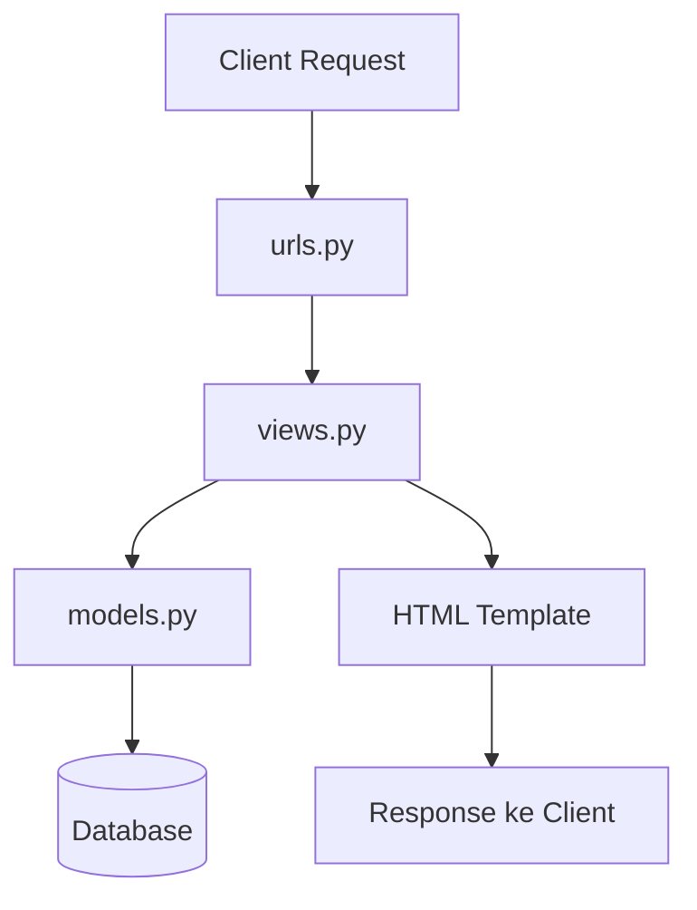

# Tugas 2

## 🌐 Link Aplikasi  
Aplikasi hasil *deployment* dapat diakses di tautan berikut:  

[⚽💰 Football Bidding ⚽💰](https://naufal-zafran-footballbidding.pbp.cs.ui.ac.id/)  

---
 

## 🛠️ Implementasi Step-by-Step  

### 1. Membuat Proyek Django Baru  
Menjalankan perintah berikut untuk membuat proyek:  
```bash
django-admin startproject football-bidding .
````
_jangan lupa ```.``` di akhir ya_

Langkah ini bertujuan untuk men-setup 'fasilitas' dar django utnuk mempermudah pengembangan web. Sebelumya, kita harus telah mengundur requirement yang terkait

### 2. Membuat Aplikasi `main`

Menjalankan perintah:

```bash
python manage.py startapp main
```

Kemudian menambahkan `main` ke dalam `INSTALLED_APPS` di `settings.py`.

### 3. Routing Aplikasi `main`

* Membuat file `urls.py` di dalam aplikasi `main`.
* Menghubungkan aplikasi `main` dengan `urls.py` pada proyek utama menggunakan `include()` dan ```urlpatterns``` yang berfungsi untuk merujuk ke ```main```.

### 4. Membuat Model `Product`

Pada `models.py` aplikasi `main`:

```python
class Product(models.Model):
    CATEGORY_CHOICES = [
        ('historic', 'Historic'),
        ('exclusive', 'Exclusive'),
        ('fan', 'Fan'),
        ('misc', 'Miscellanous'),
    ]
    
    name = models.CharField()
    price = models.IntegerField()
    description = models.TextField()
    thumbnail = models.URLField()
    category = models.CharField(choices=CATEGORY_CHOICES)
    is_featured = models.BooleanField()
    likes = models.IntegerField()
    
    def __str__(self):
        return self.name
    
    @property
    def is_product_trending(self):
        return self.likes > 100
        
    def increment_likes(self):
        self.news_views += 1
        self.save()
```

Saya membuat model seperti demikian untuk mengakomodasi objek yang sering menjadi interaksi user. ```CATEGORY_CHOICES``` adalah kategori barang lelangan. Saya juga menambahkan beberapa _field_ yang relevan dalam fitur terkait wesite lelang ini selain dari yang telah dispesifikasi

Menjalankan migrasi database agar perubahan ini terekam:

```bash
python manage.py makemigrations
python manage.py migrate
```

### 5. Membuat Fungsi pada `views.py`

Membuat fungsi `show_main` untuk menampilkan nama aplikasi, nama, dan kelas melalui template HTML yang tersimpan pada `main.html`.

### 6. Routing `main/urls.py`

Menambahkan kode berikut:

```python
from django.urls import path
from . import views

urlpatterns = [
    path('', views.index, name='index'),
]
```

### 7. Deployment ke PWS

* Membuat project baru di PWS
* Menyalin kredensial dari PWS ke dalam kode saya
* Mengatur konfigurasi web app agar proyek dapat diakses secara publik.
* Menjalankan kode berikut:

```shell
git add .
git commit -m "yapping"
git push origin master
git push pws master
```

---

## 📊 Alur Request & Response pada Django



**Penjelasan:**

* `urls.py` → menangani pemetaan URL ke fungsi view.
* `views.py` → berisi logika aplikasi dan pemrosesan data.
* `models.py` → merepresentasikan struktur data yang disimpan di database.
* Template (HTML) → menampilkan data dalam bentuk yang ramah pengguna.

---

## ❓ Pertanyaan & Jawaban

### 1. Bagaimana cara kamu mengimplementasikan checklist di atas secara step-by-step?

### 1. Bagaimana cara kamu mengimplementasikan checklist di atas secara step-by-step?  

Saya memulai dengan membuat proyek Django baru menggunakan `django-admin startproject football-bidding.`, lalu membuat aplikasi `main` dengan `python manage.py startapp` dan menambahkannya ke `INSTALLED_APPS` di `settings.py`. Setelah itu, saya mengatur routing dengan membuat `urls.py` di aplikasi `main` dan menghubungkannya dengan `urls.py` proyek utama agar request yang masuk dapat diarahkan ke aplikasi. Selanjutnya, saya membuat model `Product` di `models.py` dengan field yang telah ditentukan, menambahkan beberapa field tambahan seperti `likes`, serta membuat method untuk mengecek tren produk. Perubahan pada model kemudian saya migrasikan ke database dengan `makemigrations` dan `migrate`.  

Setelah model siap, saya membuat fungsi `show_main` di `views.py` untuk menampilkan nama aplikasi, nama saya, dan kelas melalui template HTML, serta menambahkan routing di `main/urls.py` untuk memanggil fungsi tersebut. Terakhir, saya melakukan deployment ke PWS dengan membuat project baru, menghubungkan kredensial, mengatur konfigurasi web app, dan mendorong kode menggunakan Git. Dengan langkah-langkah tersebut, aplikasi berhasil berjalan baik secara lokal maupun di server PWS.  


---

### 2. Buatlah bagan yang berisi request client ke web aplikasi berbasis Django beserta responnya!


---

### 3. Jelaskan peran `settings.py` dalam proyek Django!

File `settings.py` menyimpan semua konfigurasi proyek, seperti:

* Daftar aplikasi dalam `INSTALLED_APPS`
* konfigurasi database (e.g., PostgreSQL, MySQL, SQLite) dan hal lainnya
* Middleware dan template
* Konfigurasi static files dan lainnya
* Menyinpan informasi terkait sekuritas website

Tanpa `settings.py`, proyek tidak dapat berjalan dengan benar, semua komponen web baik business logic maupun perintilan _backend_ akan tidak sinkron.

---

### 4. Bagaimana cara kerja migrasi database di Django?

* `makemigrations`: Django mendeteksi perubahan pada model dan membuat file migrasi.
* `migrate`: Django menerapkan migrasi ke database sehingga struktur data sesuai dengan model yang didefinisikan.

---

### 5. Mengapa framework Django dijadikan permulaan pembelajaran pengembangan perangkat lunak?

* Django memiliki dokumentasi lengkap dan komunitas luas.
* *Batteries included*: banyak fitur bawaan (auth, ORM, admin site).
* Menerapkan pola arsitektur *MVT* yang umum di dunia nyata.
* Cocok untuk pemula karena menyediakan fondasi kuat untuk mempelajari framework web lainnya.

Framework lain seperti **Flask** atau **FastAPI** memang lebih ringan dan fleksibel, tetapi justru menuntut pemula untuk membuat banyak keputusan sejak awal (misalnya pemilihan ORM, autentikasi, atau struktur proyek). Umumnya, kontrol granular seperti ini ditujukan bagi profesional, kurang cocok untuk pemula. Karena itu, Django lebih cocok sebagai pijakan awal sebelum mencoba framework yang lebih minimalis atau spesifik kebutuhan.  

---

### 6. Apakah ada feedback untuk asisten dosen tutorial 1?

Penjelasan sangat memuaskan, terutama bagi saya yang belum memiliki pengalaman pengrograman di luar CLI, kuliah PBP sejauh ini memberikan gambaran yang baik bagi saya dalam memulai mengaplikasikan ide saya dalam bentuk yang lebih konkrit. 
---

 **\[Naufal Zafran Fadil] - \[2406402542]**

```